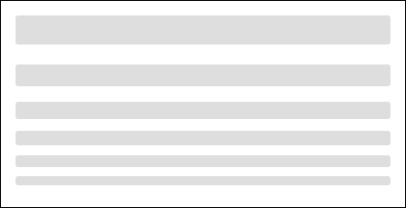

# skellyCSS
A light-weight CSS framework to quickly implement skeletons into your projects.


<h2>Table of Contents</h2>

- [skellyCSS](#skellycss)
  - [Installation](#installation)
    - [CSS](#css)
    - [JavaScript](#javascript)
  - [Usage](#usage)
    - [Headers](#headers)
    - [Paragraphs](#paragraphs)
    - [Line Width](#line-width)
    - [Alignment](#alignment)
    - [Images](#images)
      - [Sizes](#sizes)
      - [Shapes](#shapes)
    - [Animation](#animation)
  - [JavaScript Utility](#javascript-utility)

<br />

## Installation
### CSS
Include the skelly.css file wherever you add your CSS:
``` html
<link rel="stylesheet" href="../dist/skelly.css">
```

### JavaScript
Include the skelly.js file wherever you add your JavaScript:
``` html
<script src="../dist/skelly.js"></script>
```

<br />

## Usage
Skeletons can be quickly added to any project with a few simple lines of code. 

### Headers
Apply the `skeleton` class to any type of header and it will automatically adjust to the font-size of the header stylings:



``` html
<h1 class="skeleton"></h1>
<h2 class="skeleton"></h2>
<h3 class="skeleton"></h3>
<h4 class="skeleton"></h4>
<h5 class="skeleton"></h5>
<h6 class="skeleton"></h6>
```

<br />

### Paragraphs
You can create paragraph skeletons by applying the `skeleton` class to the paragraph tag, then including however many span tags you'd like with the `skeleton__line` class within the paragraph. In order to make the paragraph skeleton look more like a paragraph, the last line is set to 50% width.


```html
<div>
  <p class="skeleton">
    <span class="skeleton__line"></span>
    <span class="skeleton__line"></span>
    <span class="skeleton__line"></span>
    <span class="skeleton__line"></span>
  </p>
</div>
```

<br />

### Line Width
You can adjust the line width by applying a size modifier class:
| Width | Modifier Class | 
| ------------ | ------------|
| Small, 25% | `.skeleton--sm` |
| Medium, 50% | `.skeleton--md` |
| Large, 75% | `.skeleton--lg` |
| Full, 100% | `.skeleton--full` |


``` html
<h1 class="skeleton skeleton--sm"></h1>
<h1 class="skeleton skeleton--md"></h1>
<h1 class="skeleton skeleton--lg"></h1>
<h1 class="skeleton skeleton--full"></h1>
```

<br />

### Alignment
You can text align the skeleton using alignment modifier classes:

| Alignment | Modifier Class |
| ------------ | ------------|
| Left | `.skeleton--left` |
| Right | `.skeleton--right` |
| Center | `.skeleton--center` |


``` html
<!-- Left Align -->
<p class="skeleton skeleton--left">
  <span class="skeleton__line"></span>
  <span class="skeleton__line"></span>
  <span class="skeleton__line"></span>
  <span class="skeleton__line"></span>
</p>

<!-- Center Align -->
<p class="skeleton skeleton--center">
  <span class="skeleton__line"></span>
  <span class="skeleton__line"></span>
  <span class="skeleton__line"></span>
  <span class="skeleton__line"></span>
</p>

<!-- Right Align -->
<p class="skeleton skeleton--right">
  <span class="skeleton__line"></span>
  <span class="skeleton__line"></span>
  <span class="skeleton__line"></span>
  <span class="skeleton__line"></span>
</p>
```

<br />

### Images
You can create an image skeleton by adding the `.skeleton-image` class to an img tag -- do not include the `src` attribute. By default this will apply the image skeleton at 100% height and width of the parent container.

#### Sizes
We have included some default sizes included for skeleton images:

| Size | Modifier Class |
| ------------ | ------------| 
| Small, 50x50 | `.skeleton-image--sm` |
| Medium, 100x100 | `.skeleton-image--md` |
| Large, 200x200 | `.skeleton-image--lg` |
| X-Large, 400x400 | `.skeleton-image--xl` |
| Full, 100% x 100% | `.skeleton-image--full` |


``` html


```

<br />

#### Shapes
You can also do different shapes using shape modifier classes:

| Shape | Description | Modifier Class |
| ------------ |------------ | ------------| 
| Landscape Rectangle | Sets the width of the image to 100% | `.skeleton-image--landscape` |
| Portrait Rectangle | Sets the height of the image to 100% | `.skeleton-image--portrait` |
| Circle | Sets the border radius to 50% | `.skeleton-image--circle` |


``` html


```

<br />

### Animation
You can include a `span.skeleton--animation` within a header or paragraph to apply an animation to it.


``` html
<div>
  <p class="skeleton">
    <span class="skeleton__line">
      <span class="skeleton--animation"></span>
    </span>
        <span class="skeleton__line">
      <span class="skeleton--animation"></span>
    </span>
    <span class="skeleton__line">
      <span class="skeleton--animation"></span>
    </span>
    <span class="skeleton__line">
      <span class="skeleton--animation"></span>
    </span>
  </p>
</div>
```

<br />

## JavaScript Utility
We've also built in a JavaScript utility to help create skeletons easier. On either a header tag or a paragraph tag, add the `skeleton` class and a `data-lines` attribute with the number of lines you'd like the skeleton to have:

``` html
<h2 class="skeleton skeleton--md" data-lines="2"></h2>
<p class="skeleton" data-lines="7"></p>
```

<br />

You can also give the skeleton animation by adding the `data-animation` attribute and setting it to `true`:

``` html
<h2 class="skeleton skeleton--md" data-animation="true"></h2>
<p class="skeleton" data-lines="7" data-animation="true"></p>
```

<br />