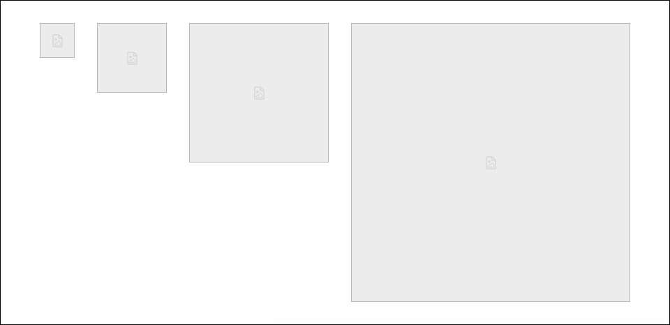

<div style="display:flex; align-items:center; justify-content:center; height:300px;">
  
</div>

# skellyCSS
A light-weight CSS framework to quickly implement skeletons into your projects.


<h2>Table of Contents</h2>

- [skellyCSS](#skellycss)
  - [Installation](#installation)
    - [npm](#npm)
    - [CSS](#css)
    - [JavaScript](#javascript)
  - [Quick Usage](#quick-usage)
  - [Usage](#usage)
    - [Headers](#headers)
    - [Paragraphs](#paragraphs)
    - [Line Width](#line-width)
    - [Alignment](#alignment)
    - [Images](#images)
      - [Sizes](#sizes)
      - [Shapes](#shapes)
    - [Animation](#animation)
  - [JavaScript Utility](#javascript-utility)
    - [JavaScript Data Attributes](#javascript-data-attributes)
      - [All Data Attributes](#all-data-attributes)

<br />

## Installation
### npm
To install via node package manager:
```shell
npm install @ritterim/skellycss
```
### CSS
Include the Skelly css file wherever you add your CSS:
``` html
<link rel="stylesheet" href="..@ritterim/skellycss/dist/style.css">
```

### JavaScript
Include the skelly.js file wherever you add your JavaScript:
``` html
<script src="..@ritterim/skellycss/dist/skelly.js"></script>
```

<br />

## Quick Usage
You can quickly get started using skellyCSS using the JavaScript utility, like so:
``` html
<h2 class="skeleton skeleton--md" data-animation="true"></h2>
<p class="skeleton" data-lines="4" data-animation="true"></p>
```
**See full [JavaScript Utility](#javascript-utility) docs below**

<br />

## Usage
Skeletons can be quickly added to any project with a few simple lines of code. 

### Headers
Apply the `skeleton` class to any type of header and it will automatically adjust to the font-size of the header stylings:


``` html
<h1 class="skeleton"></h1>
<h2 class="skeleton"></h2>
<h3 class="skeleton"></h3>
<h4 class="skeleton"></h4>
<h5 class="skeleton"></h5>
<h6 class="skeleton"></h6>
```

<br />

### Paragraphs
You can create paragraph skeletons by applying the `skeleton` class to the paragraph tag, then including however many span tags you'd like with the `skeleton__line` class within the paragraph. In order to make the paragraph skeleton look more like a paragraph, the last line is set to 50% width.


```html
<div>
  <p class="skeleton">
    <span class="skeleton__line"></span>
    <span class="skeleton__line"></span>
    <span class="skeleton__line"></span>
    <span class="skeleton__line"></span>
  </p>
</div>
```

<br />

### Line Width
You can adjust the line width by applying a size modifier class:
| Width | Modifier Class | 
| ------------ | ------------|
| Small, 25% | `.skeleton--sm` |
| Medium, 50% | `.skeleton--md` |
| Large, 75% | `.skeleton--lg` |
| Full, 100% | `.skeleton--full` |


``` html
<h1 class="skeleton skeleton--sm"></h1>
<h1 class="skeleton skeleton--md"></h1>
<h1 class="skeleton skeleton--lg"></h1>
<h1 class="skeleton skeleton--full"></h1>
```

<br />

### Alignment
You can text align the skeleton using alignment modifier classes:

| Alignment | Modifier Class |
| ------------ | ------------|
| Left | `.skeleton--left` |
| Center | `.skeleton--center` |
| Right | `.skeleton--right` |


``` html
<!-- Left Align -->
<p class="skeleton skeleton--left">
  <span class="skeleton__line"></span>
  <span class="skeleton__line"></span>
  <span class="skeleton__line"></span>
  <span class="skeleton__line"></span>
</p>

<!-- Center Align -->
<p class="skeleton skeleton--center">
  <span class="skeleton__line"></span>
  <span class="skeleton__line"></span>
  <span class="skeleton__line"></span>
  <span class="skeleton__line"></span>
</p>

<!-- Right Align -->
<p class="skeleton skeleton--right">
  <span class="skeleton__line"></span>
  <span class="skeleton__line"></span>
  <span class="skeleton__line"></span>
  <span class="skeleton__line"></span>
</p>
```

<br />

### Images
You can create an image skeleton by using the `.skeleton-image` class. By default this will apply the image skeleton at 100% height and width of the parent container.

#### Sizes
Here are some default sizes we have included for skeleton images:

| Size | Modifier Class |
| ------------ | ------------| 
| Small, 50x50 | `.skeleton-image--sm` |
| Medium, 100x100 | `.skeleton-image--md` |
| Large, 200x200 | `.skeleton-image--lg` |
| X-Large, 400x400 | `.skeleton-image--xl` |
| Full, 100% x 100% | `.skeleton-image--full` |



``` html


```

<br />

#### Shapes
You can also make different image shapes using shape modifier classes:

| Shape | Description | Modifier Class |
| ------------ |------------ | ------------| 
| Square | Sets the image aspect ratio to 1/1 (default) | `.skeleton-image--square` |
| Circle | Sets the border radius to 50% | `.skeleton-image--circle` |
| Landscape Rectangle | Sets the image aspect ratio to 4/3 | `.skeleton-image--landscape` |
| Portrait Rectangle | Sets the image aspect ratio to 3/4| `.skeleton-image--portrait` |
| Wide Rectangle | Sets the image aspect ratio to 16/9 | `.skeleton-image--wide` |
| Tall Rectangle | Sets the image aspect ratio to 9/16 | `.skeleton-image--tall` |

``` html
<div class="skeleton-image skeleton-image--lg skeleton-image--square"></div>
<div class="skeleton-image skeleton-image--lg skeleton-image--circle"></div>
<div class="skeleton-image skeleton-image--lg skeleton-image--landscape"></div>
<div class="skeleton-image skeleton-image--lg skeleton-image--portrait"></div>
<div class="skeleton-image skeleton-image--lg skeleton-image--wide"></div>
<div class="skeleton-image skeleton-image--lg skeleton-image--tall"></div>
```

<br />

### Animation
To add animation, add a `span.skeleton--animation` within the `.skeleton__line` elements in headers or paragaphs.


``` html
<div>
  <p class="skeleton">
    <span class="skeleton__line">
      <span class="skeleton--animation"></span>
    </span>
        <span class="skeleton__line">
      <span class="skeleton--animation"></span>
    </span>
    <span class="skeleton__line">
      <span class="skeleton--animation"></span>
    </span>
    <span class="skeleton__line">
      <span class="skeleton--animation"></span>
    </span>
  </p>
</div>
```

<br />

## JavaScript Utility
The easiest and our preferred way to add Skeletons is by using the included JavaScript utilities. 

On either a header tag or a paragraph tag, add the `skeleton` class and a `data-lines` attribute with the number of lines you'd like the skeleton to have:

``` html
<h2 class="skeleton skeleton--md" data-lines="2"></h2>
<p class="skeleton" data-lines="7"></p>
```

<br />

You can also give the skeleton animation by adding the `data-animation` attribute and setting it to `true`:

``` html
<h2 class="skeleton skeleton--md" data-animation="true"></h2>
<p class="skeleton" data-lines="7" data-animation="true"></p>
```

<br />

### JavaScript Data Attributes
You can alter the way skeleton looks by utilizing other data-attributes as well, including opacity and color:
``` html
<!-- Opacity -->
<h2 class="skeleton skeleton--md" data-animation="true"></h2>
<p class="skeleton" data-lines="7" data-opacity="0.3"></p>

<!-- Color -->
<h2 class="skeleton skeleton--md" data-animation="true"></h2>
<p class="skeleton" data-lines="7" data-color="tomato"></p>
```

#### All Data Attributes
| Attribute | Description | Type |
| ------------ |------------ | ------------| 
| `data-lines` | Determines how many lines to output | Integer |
| `data-animation` | Adds animation to the skeleton lines | Boolean |
| `data-opacity` | Sets the opacity of the skeleton lines (sets opacity between 0 and 1) | Float |
| `data-color` | Sets the color of the skeleton lines | Color |